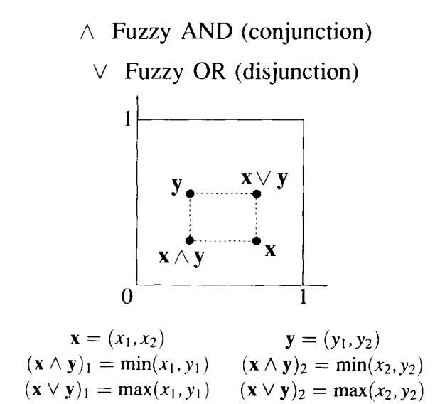

# PyTorchFuzzyART



Torch implementation of G.Carpenter and S.Grossberg Fuzzy ART algorithm 
Based on 
https://github.com/jacksavage/DocClusterART (corrected few differences from original paper)
and
https://doi.org/10.1016/0893-6080(91)90056-B


Here is an example of running it with 20 samples of 2D points with vigilance of 0.9 
```
Label : Pattern : Category
     0: [[0.69543761 0.59589849]] : [0.69543761 0.59589849]
     1: [[0.43225307 0.00084859]] : [0.43225307 0.00084859]
     2: [[0.19550712 0.58637822]] : [0.19550712 0.58637822]
     3: [[0.54343984 0.98790759]] : [0.54343984 0.98790759]
     4: [[0.76336019 0.00821886]] : [0.76336019 0.00821886]
     5: [[0.99641583 0.00434456]] : [0.99641583 0.00434456]
     6: [[0.46253131 0.73959531]] : [0.46253131 0.73959531]
     7: [[0.57714177 0.0885745 ]] : [0.57714177 0.0885745 ]
     7: [[0.44628105 0.11197951]] : [0.5640557 0.0885745]
     8: [[0.23095802 0.98740804]] : [0.23095802 0.98740804]
     9: [[0.64266754 0.8760654 ]] : [0.64266754 0.8760654 ]
    10: [[0.16031903 0.40798481]] : [0.16031903 0.40798481]
     9: [[0.59867845 0.73157611]] : [0.63826863 0.86161647]
     6: [[0.46286435 0.8122567 ]] : [0.46253131 0.73959531]
     0: [[0.72177354 0.6808743 ]] : [0.69543761 0.59589849]
     0: [[0.74535329 0.58444817]] : [0.69543761 0.59475345]
    11: [[0.23855079 0.01791211]] : [0.23855079 0.01791211]
    12: [[0.49144879 0.49758301]] : [0.49144879 0.49758301]
     2: [[0.05194829 0.54159323]] : [0.18115124 0.58189972]
     2: [[0.08174443 0.60438669]] : [0.17121056 0.58189972]
Num of Cat:13
```
